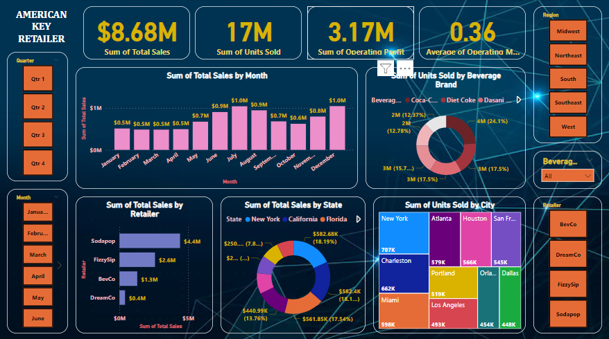

# American Key Retailer Data Analytics Project
## Overview
This is a comprehensive data analytics project focusing on American Key Retailer data. The project involves web scraping, data cleaning, transformation, dashboard building, and insights extraction. We aim to analyze the retailer's data to derive insights that can inform decision-making and strategy development.

## Contents
- Data Cleaning and Transformation in Python Pandas
- Data Transformation in Power Query (using DAX Query.csv file)
- Data Modeling and Building Parameters Using DAX
- Building Dashboard in Power BI
- Extracting Insights from the Dashboard for Decision-Making

## Description
In this project, we utilize web scraping techniques to collect data from various American Key Retailer websites. We then perform data transformation and cleaning using Python Pandas. Next, we use Power Query for additional data transformation. Following that, we use DAX for data modeling and building parameters. Finally, we build a dashboard in Power BI to visualize the insights derived from the data.

This project is designed to enhance your data science skills and can serve as a valuable addition to your resume. It provides a structured approach to data analytics and visualization, allowing you to gain practical experience in real-world data analysis scenarios.

## Result
Dashboard Results

## How to Use
- Clone or download the project repository.
- Install the required dependencies.
- Follow the step-by-step guide provided in each section of the project.
- Use the provided data and scripts to replicate the project on your own system.
- Customize and modify the project as needed for your own learning or presentation purposes.
## Contributors
[OUAKIB Amine]
## License
This project is licensed under the [OUAKIB Amine]. See the LICENSE file for details.